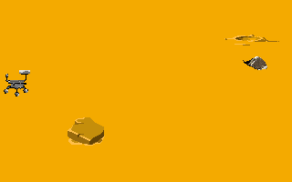
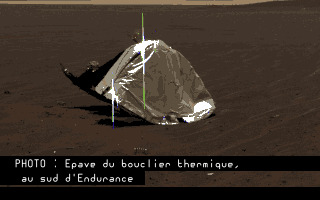
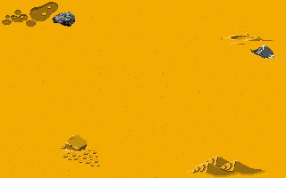
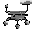
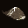
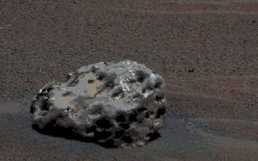
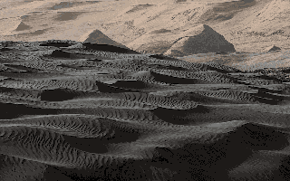
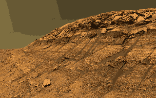
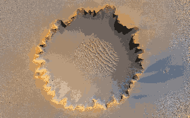

# **Consignes**
## Workshop  
#### Outils
- Installer un émulateur pour la machine choisie  
=> https://fs-uae.net/
- Travailler avec Github education et VScode
Lien Classroom Github
https://classroom.github.com/a/7o-29Ai3
- Travailler avec copilot dans VScode

#### Ce que j'ai utilisé :
Émulateur
- Émulateur : FS-UAE
- Code dans l'émulateur : AMOS PRO 2.0

Visuels
- Dessins : Pixilart, Krita (-> Fichiers _Kexp)
- Gestion de l'échelle et des couleurs : GIMP (-> Fichiers _Gexp)
- Conversion en .iff : XnViewMP (-> Fichiers _Xexp)

J'ai aussi contribué au Wiki DAD avec certaines choses que j'ai trouvé :  
- [WIKI DAD - Comment utiliser AMOS (logiciel de programmation) sur Amiga 500+](https://wiki.dad.ynh.fr/books/guideline-amiga-500-plus/chapter/comment-utiliser-amos-logiciel-de-programmation-sur-amiga-500) => 4 articles
- [Configurer l'émulateur FS-UAE pour Amiga 500+](https://wiki.dad.ynh.fr/books/guideline-amiga-500-plus/chapter/configurer-lemulateur-fs-uae-pour-amiga-500) => 1 article
- et d'autres à venir dès que j'aurais le temps...

## Objectifs
- Écrire un projet : jeu, texte, diaporama, etc.
- Anacronisme entre machine et expérience.

## Rendu 
- Disquette avec jaquette (possible dans tous les cas de figure)
- Émulation
- Scratch (écrit sur la machine)

# **Projet**
## Titre
_My battery is low and it's getting dark_

## Mots-clés
Mars,
Exploration spatiale,
Avancées technologiques

## Description
_My battery is low and it's getting dark_ est un jeu d'exploration où le joueur découvre la planète Mars par les yeux du rover Opportunity.
Une session de jeu retrace les 15 ans de vie du robot à une échelle réduite où 1 an = 40 secondes.

Pas de spoil, vous découvrirez l'histoire par vous-même.

P.S. Je raconte l'histoire parce que je n'ai pas pu finir le projet...
Le joueur fait bouger le sprite du rover Opportunity sur des éléments interactifs qui représentent des éléments que le rover a vu sur Mars (ex : Épave du bouclier thermique en décembre 2004, etc.) avec une petite histoire à chaque fois. Lorsque le compteur arrive à 2018, le message "My battery is low and it's getting dark" apparait et le jeu s'arrête, ces derniers mots étant ceux du petit rover marsien, éteint en 2018.

## Journal de bord

La semaine du 15 au 19 décembre a été très intensive (c'ets le but me direz-vous) mais très intensive dans le sens où mes nuits ont été très réduites...
Ce projet était pour moi un challenge à la fois machine car j'aime beaucoup l'archéologie des médias mais je ne connaissais que très peu la partie logiciel de l'Amiga, mais aussi un challenge de programmation.  

Les IAs ne nous (les 3DAD qui travaillaient sur l'Amiga) ont pas beaucoup aidés...
Mais ! J'ai trouvé une solution :
Dans le prompt, il faut intégrer/dire clairement "prends comme référence ces documentations : " et lui lister les documents/liens/sites etc. que l'on souhaite utiliser.
Un prompt typique pour ma part :   
"Tu es un expert absolu d'AMOS Professional (AMOS Pro 2.0) pour Amiga 500+ (OCS/ECS, 512Ko-1Mo RAM, Kickstart 2.0). Prends pour référence ces documentations :  
https://amospromanual.dev/  
[Le Bazar de Monos, Playlist de  vidéos youtube : AMOS](https://www.youtube.com/playlist?list=PLSZp8EDKoyw8x34puNQAZWbbZOPbnFzpT)  
QUERY :  
-- requête --
"

Perplexity.ai est celle qui a le mieux fonctionné avec ce système mais les vidéos de [la playlist](https://www.youtube.com/playlist?list=PLSZp8EDKoyw8x34puNQAZWbbZOPbnFzpT) que je donne dans le prompt sont encore plus utiles.

Vers la fin de la semaine d'intensif (soit 20h de sommeil cumulées youhou !) j'ai réussi à avoir... un sprite qui bouge avec les flèches directionnelles sur un écran !

<video controls src="aperçu/documentation/Enregistrement de l’écran 2025-12-18 à 12.38.27.mov" title="Title"></video>
<video controls src="aperçu/documentation/Enregistrement de l’écran 2025-12-18 à 13.14.15.mov" title="Title"></video>

Le dernier jour, j'ai réussi à importer mon propre sprite et, même s'il n'avait pas les bonnes couleurs (problème de palette dont je n'avais pas connaissance à ce moment là) il fonctionnait.  
Sprite rover avec les mauvaises couleurs :  

# Mais je ne voulais pas m'arrêter là

Maquette de l'aperçu final :  

**Update du 22-12 :** J'ai persévéré au delà de la semaine de cours et j'ai réussi à faire beaucoup de chose !  
**Update du 25-12 :** J'ai fini le jeu !!!!

### Rendu final et démonstration :

<video controls src="aperçu/jeu-fini.mp4" title="Vidéo de démonstration du jeu fini !"></video>

### Les images dans le jeu :  
Fond du jeu :  

Le joueur :  

#### Les objets à explorer :  

Épave du bouclier thermique, au sud d'Endurance (décembre 2004)  
  

Météorite Heat Shield Rock (janvier 2005)  
  

Dunes :  
  

La falaise Burns, à l'intérieur du cratère Endurance (décembre 2004) :  
  

Le cratère Victoria (septembre 2006) :  
  

## Comment lancer le jeu dans AMOS PRO 2.0 sur Amiga 500+

1. Télécharger le dossier [MyBatteryIsLow_Game](projets/MyBatteryIsLow/SORTIE/MyBatteryIsLow_Game).
2. Importer la banque [MyBatteryIsLow.Abk](projets/MyBatteryIsLow/img/MyBatteryIsLow.Abk) dans Amos Pro.
3. Importer le script [MyBatteryIsLow.ASC](projets/MyBatteryIsLow/MyBatteryIsLow.ASC).
4. Lancer le jeu.